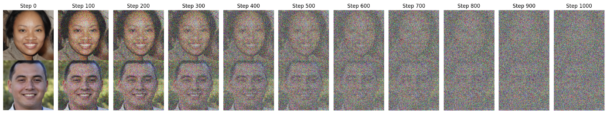

#diffDeMorph: Extending Reference-Free Demorphing to Unseen Faces

**Authors:** Nitish Shukla, Arun Ross  
**Venue:**  IEEE International Conference on Image Processing (ICIP, 2025)


## Abstract

A face morph is created by combining two face images corresponding to two identities  to produce a composite that successfully matches both the constituent identities. Reference-free (RF) demorphing reverses this process using only the morph image, without the need for additional reference images. Previous RF demorphing methods are overly constrained, as they rely on assumptions about the distributions of training and testing morphs such as the morphing technique used (e.g., landmark-based) and face image style (e.g., passport photos). In this paper, we introduce a novel diffusion-based approach, referred to as diffDeMorph,  that effectively disentangles component images from a composite  morph image with high visual fidelity. Our method is the first to generalize across morph techniques and face styles, beating the current state of the art by ≥59.46% under a common training protocol across all datasets tested. We train our method on morphs created using synthetically generated face images and test on real morphs, thereby enhancing the practicality of the technique. Experiments on six datasets and two face matchers establish the utility and efficacy of our method.  

## Methodology
<div style="display: flex; gap: 20px;">

<div style="text-align: center;">
  <p>Forward Coupled Diffusion</p>
  
</div>

<div style="text-align: center;">
  <p>DEMORPHED OUTPUTS</p>
  
</div>

</div>

*Dual-Conditioned GAN for Reference-Free Demorphing: An image encoder, E, encodes the morph image, which is then used to condition the generator. The generator, based on a UNet architecture, G, takes in the MORPH image and the encoded representation, E(MORPH), producing two outputs, OUT1 and OUT2. The discriminator is trained to distinguish between the real set (MORPH, BF1, BF2) and the synthetic set (MORPH, OUT1, OUT2), differentiating real from synthetic pairs.*

### Contribution

- **Reference-Free & Differential Demorphing**: Works seamlessly in both settings without extra constraints.  
- **Artifact Robustness**: Effectively handles high-frequency artifacts introduced during the demorphing process.  
- **Morph Replication Prevention**: First method to overcome morph replication, even on unseen identities.  


## Results

The proposed method was evaluated on several benchmark morph datasets, demonstrating superior performance in demorphing accuracy compared to existing techniques. Quantitative results show significant improvements in terms of both visual fidelity and identity preservation.


*Figure 2: Reference-Free Demorphing Visualization: We illustrate the results of our reference-free demorphing approach. The model takes the morph image (MORPH) as input and produces two outputs (OUT1 and OUT2). The ground-truth images used to generate the morph are denoted as BF1 and BF2.*


*Figure 3:  Differential Demorphing Visualization: We illustrate the results of our differential demorphing approach. The model receives the morph image (MORPH) and the transformed ground-truth image (TRANSFORMED BF1) and produces an output (OUT). The ground truth (GT) is shown, which, along with the ground-truth image (BF1), was used to generate the morph image (MORPH). Note that our method does not assume that the demorphing process uses the exact same ground-truth image (BF1) that was used to create the morph. *
*

*Table 1: Restoration Accuracy: Comparison of our reference-free approach to SDeMorph  and Identity-Preserving Demorphing (IPD). Unlike our method, which operates on unseen faces (scenario 3) and is significantly more challenging, the other methods assume the same identities are present in both training and test morphs (scenario 1). In scenario 3, our method significantly outperforms the current state-of-the-art method.*


## Usage

To use dcGAN, follow these steps:

1. **Clone the repository**
```bash
git clone 
cd Facial-Demorphing-from-a-Single-Morph-Using-a-Latent-Conditional-GAN
```

2. **Download model weights**
```bash
mkdir pretrained
from huggingface_hub import hf_hub_download
model_path = hf_hub_download(
    repo_id="nitishshukla/pretrained-weights",
    filename="dcGAN-AMSL-RF.pth",
    local_dir="./pretrained"
)
```


3. **Run testing.ipynb**


## Citation

```
@INPROCEEDINGS{11099072,
  author={Shukla, Nitish and Ross, Arun},
  booktitle={2025 IEEE 19th International Conference on Automatic Face and Gesture Recognition (FG)}, 
  title={dc-GAN: Dual-Conditioned GAN for Face Demorphing From a Single Morph}, 
  year={2025},
  volume={},
  number={},
  pages={1-9},
  keywords={Face recognition;Gesture recognition;Image reconstruction},
  doi={10.1109/FG61629.2025.11099072}}


```

## License

This work is licensed under a [CC BY 4.0](https://creativecommons.org/licenses/by/4.0/) license.

---

For more details, please refer to the full paper: [arXiv:2507.18566](https://arxiv.org/pdf/2411.14494?).

