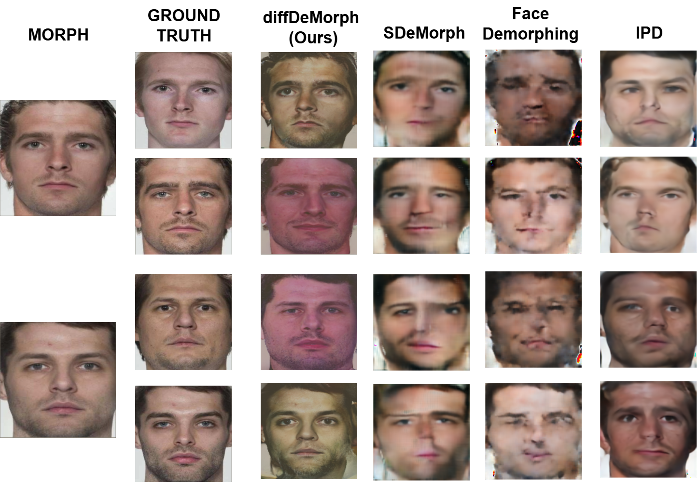

# diffDeMorph: Extending Reference-Free Demorphing to Unseen Faces

**Authors:** Nitish Shukla, Arun Ross  
**Venue:**  IEEE International Conference on Image Processing (ICIP, 2025)


## Abstract

A face morph is created by combining two face images corresponding to two identities  to produce a composite that successfully matches both the constituent identities. Reference-free (RF) demorphing reverses this process using only the morph image, without the need for additional reference images. Previous RF demorphing methods are overly constrained, as they rely on assumptions about the distributions of training and testing morphs such as the morphing technique used (e.g., landmark-based) and face image style (e.g., passport photos). In this paper, we introduce a novel diffusion-based approach, referred to as diffDeMorph,  that effectively disentangles component images from a composite  morph image with high visual fidelity. Our method is the first to generalize across morph techniques and face styles, beating the current state of the art by ≥59.46% under a common training protocol across all datasets tested. We train our method on morphs created using synthetically generated face images and test on real morphs, thereby enhancing the practicality of the technique. Experiments on six datasets and two face matchers establish the utility and efficacy of our method.  

## Methodology
<div style="display: flex; gap: 20px;">

<div style="text-align: center;">
  <p> Coupled Forward Diffusion</p>
  
</div>

<div style="text-align: center;">
  <p>Denoising</p>
  
</div>

</div>

*(Top): Coupled forward diffusion: We modify the standard diffusion process for coupled generation. Noise is added to the coupled image until it  is degenerated into pure noise.

(Bottom): Architecture of our morph guided denoiser. During inference, the morph is appended to the noisy output sample at timestep=t, providing the guidance for generation of the outputs. This process is repeated until demorphed at timestep=0 are recovered.
*

### Contribution

- **Diffusion-Based Demorphing**: Reconstructs constituent images through a diffusion based process directly in the RGB domain, outperforming current state-of-the-art methods.  
- **Style & Technique Agnostic**: Works on morphs generated using any technique or face style.  
- **Robust Performance**: Consistently achieves high visual fidelity across diverse train/test distributions and real-world scenarios.


## Results

The proposed method was evaluated on several benchmark morph datasets, demonstrating superior performance in demorphing accuracy compared to existing techniques. Quantitative results show significant improvements in terms of both visual fidelity and identity preservation.


*Figure 2: Reference-Free Demorphing Visualization: Samples generated by our method under an assumption-free training protocol. Our method generates i) distinct looking faces with higher visual fidelity compared to previous methods and, ii) the generated face images match the ground truth more faithfully.*




*Figure 3: Comparing diffDeMorph with existing reference-free demorphing methods under a common training protocol. Our method produces significantly better results in terms of visual fidelity and biometric match to the ground truth images. Note that our training protocol reflects a viable real-world use case. *


*Table 1: Comparison of our baseline (same train and test dataset) with the current state-of-the-art demorphing methods in terms of TMR at 10\% FMR, when both the train and test morphs originate from the same dataset, i.e., using a consistent morph technique. *


## Usage

To use diffDemorph, follow these steps:

1. **Clone the repository**
```bash
git clone https://github.com/nitishshukla86/diffDemorph.git
cd diffDemorph
```

2. **Download model weights**
```bash
from huggingface_hub import snapshot_download
local_dir = snapshot_download(
    repo_id="nitishshukla/pretrained-weights",
    allow_patterns=["diffDemorph/*"],
    local_dir="./pretrained"
)

```


3. **Demorph**
```bash
python demorph.py --img_path ./assets/morph.png --save_path ./assets/ --num_steps 10
```
- `--morph_path`: Path to the morph image.
- `--output_dir`: Directory where demorphed images will be saved.


## Citation

```
@INPROCEEDINGS{shukla2025diffdemorph,
  author={Shukla, Nitish and Ross, Arun},
  booktitle={}, 
  title={diffDemorph: Extending Reference-Free Demorphing to Unseen Faces}, 
}


```

## License

This work is licensed under a [CC BY 4.0](https://creativecommons.org/licenses/by/4.0/) license.

---

For more details, please refer to the full paper: [arXiv:2507.18566](https://arxiv.org/abs/2505.14527).
